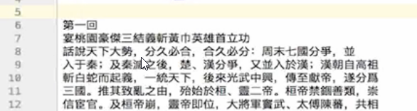

#  17.【Python学习分享文章】_function（函数）_1

## 综述

### - 作用

将会重复使用的代码片段，进行打包处理，封装成一个模块，之后使用的时候就调用函数的名字就可以全部使用函数里面所有的代码。

目的：精简代码可读性（函数的名字可以符合生活逻辑）、修改性（修改定义的函数内部的代码，就相当于修改了程序中所有相关内容）

### - 格式

#### -- 函数的定义
```
def 你想取的函数的名字(括号这里面的是定义的临时变量名字，就是参数)：
    函数的内容代码
```
#### -- 函数的调用、使用
```
已经定义的函数的名字(参数的名字=希望传入的数值内容)
```

## 举例 demo 介绍

### - 例子：简单版-计算圆柱体积

实现：

1. 输入两个数字，第一个作为圆柱的“底面半径”，第二个作为圆柱的“高”，计算这个圆柱的“体积”。
2. 连续输入5次


```python
def theVolumeOfCylinder(temp_r, temp_h): # 定义函数需要使用的参数，只是作为 临时变量 进行定义，并不具有实际数值，需要等待调用的时候传入
    aera = 3.1415926 * temp_r * temp_r # 使用的 temp_r、temp_h 是函数定义的临时变量，不具有数据内容，相当与是“站位”，等待数据传入
    volume = aera * temp_h # 计算最后的 cylinder's volume
    return volume # 调用这个函数后，返回的数值是计算的 volume

input_r = float(input('please input the r of the cylinder:'))
input_h = float(input('please input the h of the cylinder:'))
print(theVolumeOfCylinder(input_r, input_h)) # 将输入的 input_r 和 input_h 作为函数参数的数值内容传入，进行数据处理

input_r = float(input('please input the r of the cylinder:'))
input_h = float(input('please input the h of the cylinder:'))
print(theVolumeOfCylinder(input_r, input_h))

input_r = float(input('please input the r of the cylinder:'))
input_h = float(input('please input the h of the cylinder:'))
print(theVolumeOfCylinder(input_r, input_h))

## for 循环解决5次重复
# for i in range(3):
#     input_r = float(input('please input the r of the cylinder:'))
#     input_h = float(input('please input the h of the cylinder:'))
#     print(theVolumeOfCylinder(input_r, input_h)) # 将输入的 input_r 和 input_h 作为函数参数的数值内容传入，进行数据处理
#     # 完整的应该是：
#     print(theVolumeOfCylinder(temp_r=input_r, temp_h=input_h)) # 将 input_r 赋值给 函数的参数 temp_r、将 input_h 赋值给 函数的参数 temp_h
```

    please input the r of the cylinder:1
    please input the h of the cylinder:1.1
    3.4557518600000003
    please input the r of the cylinder:2
    please input the h of the cylinder:2.2
    27.646014880000003
    please input the r of the cylinder:3
    please input the h of the cylinder:3.3
    93.30530022
    

【解释：】  
说明：这里为了演示需要，函数的内容没有进行“优雅的”写法。  
代码：如果不使用“函数”功能，且假设不知道 ```for``` 语句，那么，就要把函数 theVolumeOfCylinder 里面的内容（第2、3、4行）重复3次，共9行。
结果：而使用函数后，只需要使用定义好的 theVolumeOfCylinder 就完成了，计算三次就三行搞定。  
好处：减少了 9-3=6 行的代码。拓展到一个项目就更加不可想象了。

### - 例子：统计三国人物、武器信息

#### -- 前提说明
只是简单的 demo，不考虑一个人物有多个称号，比如关羽，还叫云长，这个不在这里考虑，否则代码的功能要叠加上去，不能突出要讲的重点。

#### -- 整体思路
1. 在“名字”文件中读取出一个名字；
2. 逐行读取“文章”文件，对比取得的名字，相同则数字加1；
3. 换另外一个名字，重复步骤2。直到选取完所有名字；
4. 提取

#### -- 数据解释
1. sanguo.txt 是《三国演义》的全本，文章不是连续的，大约25行会换行,如下图：
  
对于编码来说，每一行后面有换行的编码“\n”。
2. name.txt 存放研究的几个任务名字，使用“|”隔开，用来编程时切割，如下：  
```諸葛亮|關羽|劉備|曹操|孫權|關羽|張飛|呂布|周瑜|趙雲|龐統|司馬懿|黃忠|馬超```
3. weapon.txt 存放研究的武器名字，每一个武器隔一个空行是另外一个武器，如下：  


#### -- 名字提取
名字是以“|”分割的，所以使用一些方法，以“|”将名字切分成单个变量。

#### -- 武器名字提取
武器是在不同的行，都是在奇数行，所以采用奇数的判断方法获取武器名字。

#### -- 函数应用原则
对于每个名字，采取的统计信息是一样的，如果不进行功能“函数化”，那么每个名字都要进行相同的重复操作，那么代码就很冗余。

#### -- 没有进行 function 函数处理的 code

- 读取名字文件及其操作

*code：*


```python
# 读取名字文件

## 打开名字文件
name_file = open('17_func_1/name.txt', encoding="utf8") # 如果在同一个目录里面，则直接写入文件名字即可
## 读取所有名字
names = name_file.read()
print(names) # 查看读取内容的结果形式
## 以“|”作为分割标记分割出单个名字
print(names.split("|"))
```

    諸葛亮|關羽|劉備|曹操|孫權|關羽|張飛|呂布|周瑜|趙雲|龐統|司馬懿|黃忠|馬超
    ['諸葛亮', '關羽', '劉備', '曹操', '孫權', '關羽', '張飛', '呂布', '周瑜', '趙雲', '龐統', '司馬懿', '黃忠', '馬超']
    

- 读取兵器文件及其操作

*code：*


```python
# 读取兵器名称文件

# 打开武器名称文件
weapon_file = open('17_func_1/weapon.txt', encoding='utf8')
# # 会读取、得到所有武器的名字
# weapons = weapon_file.read()
# # print(weapons) # 会大约所有武器名字，很很长，可以自行运行这一行代码
# 实现获取奇数行的数据（武器名字都在奇数行）
i = 1
for line in weapon_file.readlines():
    if i%2==1:
        print(line.strip('\n')) # 因为每一行的编码还有换行编码“\n”，不去掉还是有空行
    i += 1
```

    青龍偃月刀
    丈八點鋼矛
    鐵脊蛇矛
    涯角槍
    諸葛槍
    方天畫戟
    長柄鐵錘
    鐵蒺藜骨朵
    大斧
    蘸金斧
    三尖刀
    截頭大刀
    馬岱寶刀
    古錠刀
    衠鋼槊
    丈八長標
    王雙大刀
    呂虔刀
    龍泉劍
    倚天劍
    青釭
    七寶刀
    雙股劍
    松紋廂寶劍
    孟德劍
    思召劍
    飛景三劍
    文士劍
    蜀八劍
    鎮山劍
    吳六劍
    皇帝吳王劍
    日月刀
    百辟寶刀
    龍鱗刀
    百辟匕首二
    鐵鞭
    鋼鞭
    四楞鐵簡
    雙鐵戟
    諸葛連弩
    寶雕弓
    鵲畫弓
    虎筋弦弓
    兩石力之弓
    手戟
    短戟
    飛石
    流星錘
    銅撾
    

【code 说明：】  
```strip('\n')``` 是删除掉每一行的换行编码“\n”,否则转化到 python 读取到的内容还是有空行存在。  
未增加的情况：  


- 读取《三国演义》  
【目标：】读取全文内容，就换行的头尾进行拼接

*code：*


```python
fsanguo_file = open('17_func_1/sanguo_utf8.txt', encoding='utf8')
# print(sanguo_file.read())
print(sanguo_file.read().replace('\n','')) # 去掉每一行的“\n”，将内容连接起来

## 这里就不运行了，否则会展示出全文，很麻烦
```

```print(sanguo_file.read())``` 结果：


```print(snaguo_file.read().replace('\n','')``` 结果：


#### -- 进行 function 函数处理的简单演示

- 打开人物名字文件


```python
def openAndPrint(filename):
    print(open(filename, encoding='utf8').read())
    print('这里只是为了增加函数里面的代码内容，而增加的无关紧要的代码')
    print('如果没有这些东西，就体现不出来函数解决的复杂复杂内容')
    print('假设这里的东西都是需要编写的 code')
    print('如果不实用函数功能，这些东西都是要重复输入的')
    print('但是使用函数功能后，这里的内容只要在这里输入一次就够了')
    
openAndPrint(filename='17_func_1/name.txt')
openAndPrint('17_func_1/weapon.txt')

# 同样的，这里的的代码就不运行展示结果了，很长，影响文档内容展示，就只是截图，可以自行运行
```

结果展示：  
*开头情况：*

*结尾情况：*


## 项目 demo 介绍

### - 搭建框架

下面的 code 不完整，只是中间状态的演示，不能够运行。


```python
def find_item_num(需要查找的“目标字符”):
    # 构建一个可以在全文查找、计算输入的“目标字符”出现的次数
    return 这个次数

name_dict = {} # 用于记录字符，及其次数
with open('17_func_1/name.txt', encoding='utf8') as f: # 一个语法，相当于 f = open('name.txt', encoding='utf8'),后面详细介绍
    for line in f: # 应该是因为就只有一行信息，所以可以这么写
        names_list = line.split('|')
#         print(names_list) # 用于中间临时查看代码结果
        for name in names_list:
            name_num = fint_item_num(name)
            name_dict[name] = name_num
```

    ['諸葛亮', '關羽', '劉備', '曹操', '孫權', '關羽', '張飛', '呂布', '周瑜', '趙雲', '龐統', '司馬懿', '黃忠', '馬超']
    

### - 完善 find_item_num 函数 & 统计人物次数

*code：*


```python
import re # 导入模块（相当于集成好很多函数功能的东西，相当于“拿来主义”）
def find_item_num(item_name):
    with open('17_func_1/sanguo_utf8.txt', encoding='utf8') as f:
        sanguo_book = f.read().replace('\n','')
        item_name_list = re.findall(item_name, sanguo_book) # findall 生成的数据是 n 个目标字符的 list，比如['a', 'a', 'a'....]
        # findall(第一个参数是需要寻找的目标，第二个参数是寻找的范围)，返回的是重复的出现次数的 list
#         print('名字 %s 出现了 %s 次'%(item_name, len(item_name_list))) # 用于查看过程中代码是否正常产生
    return len(item_name_list)

name_dict = {} 
with open('17_func_1/name.txt', encoding='utf8') as f:
    for line in f:
        names_list = line.split('|')
        for name in names_list:
            name_num = find_item_num(item_name=name)
            name_dict[name] = name_num
            
# 排序输出，先直接拿来用就好，这部分功能后面讲解
name_list_sorted = sorted(name_dict.items(), key=lambda item: item[1], reverse=True)
print(name_list_sorted)
# 简单解释：
# name_dict.items():将键值和数值变成 tuple，比如（‘诸葛亮’，33）
# key=lambda item:item[1]: lambda 是 Python 里面的匿名函数，相当于用完就扔的一个功能；
# key=排序的依据，这里是后面的数字，上面的‘诸葛亮’排序是就是按照“33”进行的
# reverse=True:默认是升序排列，这里改成降序排列
```

    [('曹操', 940), ('張飛', 364), ('呂布', 342), ('孫權', 321), ('趙雲', 313), ('劉備', 297), ('司馬懿', 287), ('周瑜', 240), ('馬超', 219), ('黃忠', 189), ('諸葛亮', 157), ('龐統', 82), ('關羽', 9)]
    

### - 统计 weapon 出现的次数

*code：*  
和上面基本类似，不再过多说明了


```python
weapon_dict = {}
with open('17_func_1/weapon.txt', encoding='utf8') as f:
    i = 1
    for line in f:
        if i%2 == 1:
            weapon_name = line.strip('\n')
            weapon_num = find_item_num(item_name=weapon_name)
            weapon_dict[weapon_name] = weapon_num
        i += 1
        
# 排序操作，和上面相同
weapon_list_sorted = sorted(weapon_dict.items(), key=lambda item:item[1], reverse=True)
# print(weapon_list_sorted) # 打印武器列表里面所有的内容
print(weapon_list_sorted[:10]) # 只打印前面10个内容
```

    [('大斧', 14), ('丈八點鋼矛', 4), ('雙股劍', 3), ('流星錘', 3), ('寶雕弓', 3), ('鋼鞭', 2), ('飛石', 2), ('青龍偃月刀', 2), ('方天畫戟', 2), ('短戟', 2)]
    

---
注：  
个人微信公众号：codeAndWrite
